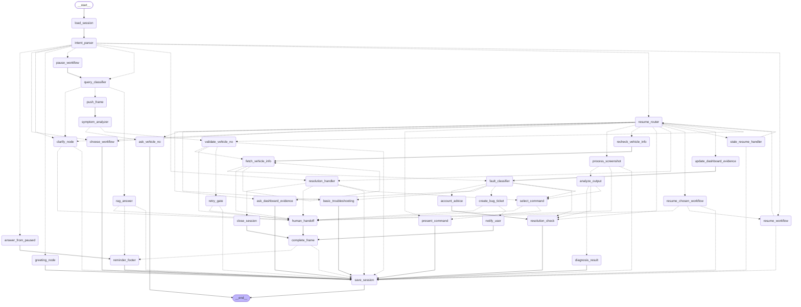

# Compiled TrackoBit Support Graph

```mermaid
---
config:
  flowchart:
    curve: linear
---
graph TD;
	__start__([<p>__start__</p>]):::first
	load_session(load_session)
	intent_parser(intent_parser)
	greeting_node(greeting_node)
	clarify_node(clarify_node)
	query_classifier(query_classifier)
	rag_answer(rag_answer)
	symptom_analyzer(symptom_analyzer)
	ask_vehicle_no(ask_vehicle_no)
	validate_vehicle_no(validate_vehicle_no)
	fetch_vehicle_info(fetch_vehicle_info)
	retry_gate(retry_gate)
	fault_classifier(fault_classifier)
	account_advice(account_advice)
	create_bug_ticket(create_bug_ticket)
	notify_user(notify_user)
	basic_troubleshooting(basic_troubleshooting)
	recheck_vehicle_info(recheck_vehicle_info)
	ask_dashboard_evidence(ask_dashboard_evidence)
	select_command(select_command)
	present_command(present_command)
	process_screenshot(process_screenshot)
	analyze_output(analyze_output)
	diagnosis_result(diagnosis_result)
	resolution_check(resolution_check)
	resolution_handler(resolution_handler)
	close_session(close_session)
	human_handoff(human_handoff)
	push_frame(push_frame)
	pause_workflow(pause_workflow)
	resume_workflow(resume_workflow)
	stale_resume_handler(stale_resume_handler)
	choose_workflow(choose_workflow)
	resume_chosen_workflow(resume_chosen_workflow)
	answer_from_paused(answer_from_paused)
	reminder_footer(reminder_footer)
	complete_frame(complete_frame)
	update_dashboard_evidence(update_dashboard_evidence)
	resume_router(resume_router)
	save_session(save_session)
	__end__([<p>__end__</p>]):::last
	__start__ --> load_session;
	account_advice --> resolution_check;
	analyze_output -.-> diagnosis_result;
	analyze_output -.-> resolution_check;
	analyze_output -.-> select_command;
	answer_from_paused --> reminder_footer;
	ask_dashboard_evidence --> save_session;
	basic_troubleshooting --> save_session;
	choose_workflow --> save_session;
	clarify_node -.-> human_handoff;
	clarify_node -.-> save_session;
	close_session --> complete_frame;
	complete_frame -.-> reminder_footer;
	complete_frame -.-> save_session;
	create_bug_ticket -.-> human_handoff;
	create_bug_ticket -.-> notify_user;
	diagnosis_result --> save_session;
	fault_classifier -.-> account_advice;
	fault_classifier -.-> ask_dashboard_evidence;
	fault_classifier -.-> basic_troubleshooting;
	fault_classifier -.-> create_bug_ticket;
	fault_classifier -.-> resolution_check;
	fault_classifier -.-> select_command;
	fetch_vehicle_info -.-> fault_classifier;
	fetch_vehicle_info -.-> human_handoff;
	greeting_node --> save_session;
	human_handoff --> complete_frame;
	intent_parser -.-> answer_from_paused;
	intent_parser -.-> choose_workflow;
	intent_parser -.-> clarify_node;
	intent_parser -.-> greeting_node;
	intent_parser -.-> pause_workflow;
	intent_parser -.-> query_classifier;
	intent_parser -.-> resolution_handler;
	intent_parser -.-> resume_router;
	intent_parser -.-> resume_workflow;
	load_session --> intent_parser;
	notify_user --> complete_frame;
	pause_workflow --> query_classifier;
	present_command --> save_session;
	process_screenshot -.-> analyze_output;
	process_screenshot -.-> human_handoff;
	process_screenshot -.-> save_session;
	push_frame --> symptom_analyzer;
	query_classifier -.-> clarify_node;
	query_classifier -.-> push_frame;
	query_classifier -.-> rag_answer;
	rag_answer -.-> human_handoff;
	rag_answer -.-> reminder_footer;
	rag_answer -.-> save_session;
	recheck_vehicle_info --> fetch_vehicle_info;
	reminder_footer --> save_session;
	resolution_check --> save_session;
	resolution_handler -.-> close_session;
	resolution_handler -.-> human_handoff;
	resolution_handler -.-> save_session;
	resolution_handler -.-> select_command;
	resume_chosen_workflow -.-> human_handoff;
	resume_chosen_workflow -.-> resume_workflow;
	resume_chosen_workflow -.-> save_session;
	resume_router -.-> ask_dashboard_evidence;
	resume_router -.-> ask_vehicle_no;
	resume_router -.-> basic_troubleshooting;
	resume_router -.-> choose_workflow;
	resume_router -.-> clarify_node;
	resume_router -.-> present_command;
	resume_router -.-> process_screenshot;
	resume_router -.-> recheck_vehicle_info;
	resume_router -.-> resolution_check;
	resume_router -.-> resolution_handler;
	resume_router -.-> resume_chosen_workflow;
	resume_router -.-> stale_resume_handler;
	resume_router -.-> update_dashboard_evidence;
	resume_router -.-> validate_vehicle_no;
	resume_workflow -.-> resume_router;
	resume_workflow -.-> save_session;
	retry_gate -.-> human_handoff;
	retry_gate -.-> save_session;
	select_command -.-> human_handoff;
	select_command -.-> present_command;
	stale_resume_handler -.-> resume_router;
	stale_resume_handler -.-> save_session;
	symptom_analyzer -.-> ask_vehicle_no;
	symptom_analyzer -.-> validate_vehicle_no;
	update_dashboard_evidence --> fault_classifier;
	validate_vehicle_no -.-> fetch_vehicle_info;
	validate_vehicle_no -.-> human_handoff;
	validate_vehicle_no -.-> retry_gate;
	validate_vehicle_no -.-> save_session;
	ask_vehicle_no --> __end__;
	save_session --> __end__;
	fetch_vehicle_info -.-> fetch_vehicle_info;
	classDef default fill:#f2f0ff,line-height:1.2
	classDef first fill-opacity:0
	classDef last fill:#bfb6fc
```
